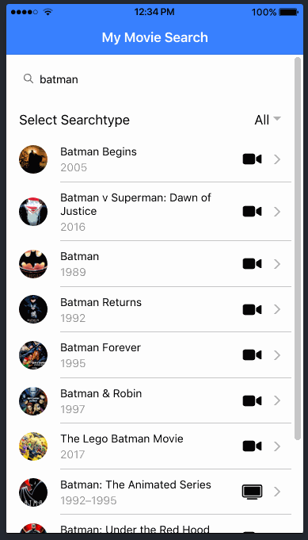
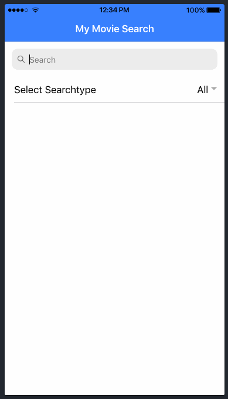

## Tutorials Ionic 4 
### Ionic 4: Ionic for Everyone

### Aplicativo
Esta é a pasta onde faremos todas as mudanças de código que seguem mais adiante neste tutorial. Ele já contém uma casa pasta que é basicamente uma página como criamos antes, mas eu gostaria de ter todas as páginas em suas próprias páginas pasta de modo que você pode remover a pasta base, bem como para agora.

A pasta de páginas contém as visualizações / páginas reais do nosso aplicativo, o que significa o elemento que veremos na tela. Agora nós já temos 2 páginas aqui, e cada página que você cria com o CLI vem com 4 arquivos:

* .module.ts: O módulo Angular para uma página. Cada página é basicamente seu próprio módulo (relacionado à arquitetura Angular) com importações e estilo
* .page.html: a marcação HTML de uma página
* .page.scss: O estilo da página específica (mais sobre estilo global depois)
* .page.spec.ts: Um arquivo de teste adicionado automaticamente para sua página. Bom se você quiser configurar testes unitários automatizados
* .page.ts: O controlador de uma página que contém o código Javascript que gerencia a funcionalidade
A pasta de serviços contém nosso serviço criado anteriormente. Trata-se de estruturar seu aplicativo de acordo com as práticas recomendadas e separar as preocupações entre a visualização e os dados reais do seu aplicativo. O serviço cuidará das chamadas da API e simplesmente retornará os dados para nossa exibição mais tarde!

### Ativos
Essa pasta contém todas as imagens, fontes ou os recursos necessários para seu aplicativo mais tarde.

### Ambientes
De tempos em tempos, seu projeto pode ter um ambiente de desenvolvimento, preparação e produção com diferentes servidores que seu aplicativo segmenta. A pasta do ambiente ajuda a configurar informações para diferentes ambientes, para que possamos mais tarde simplesmente construir nosso aplicativo Ionic com um sinalizador de linha de comando e ele automaticamente recebe os valores corretos. Muito conveniente!

### Tema
Esta pasta contém apenas as variáveis.scss que contém informações de cor predefinidas do Ionic. Podemos sempre alterar este arquivo e até mesmo usar uma ferramenta como o Ionic Color Generator para criar nossa própria versão com sabor deste arquivo!

Fora da pasta, também temos o global.scss, no qual podemos escrever alguns SCSS que serão aplicados globalmente ao nosso aplicativo - mas também podemos defini-lo apenas para uma página em seus próprios arquivos de estilo.

### Outros arquivos
O mais relevante dos outros arquivos pode ser o index.html, pois assim como com qualquer outro site, esse arquivo marca o ponto de entrada para nosso aplicativo! Por enquanto, porém, não precisamos mudar nada aqui, então vamos começar a entrar no código real.

#### From [Ionic Academy](https://ionicacademy.com). By Simon 
#### From [Tutorials](https://ionicacademy.com/ionic-4-app-api-calls/).

### Screen

